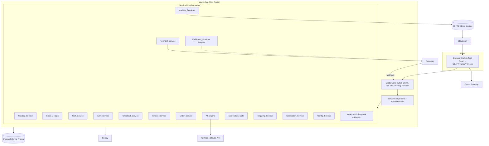
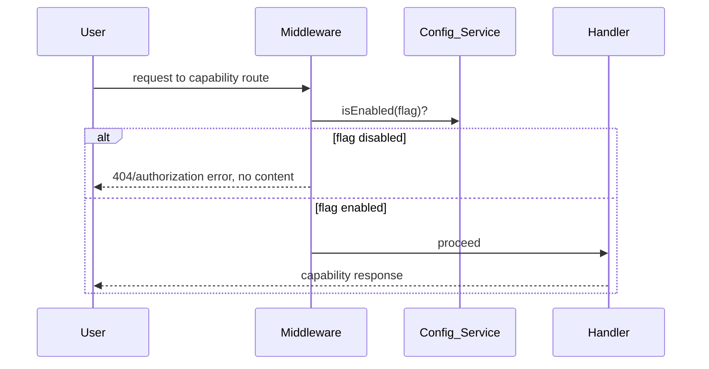
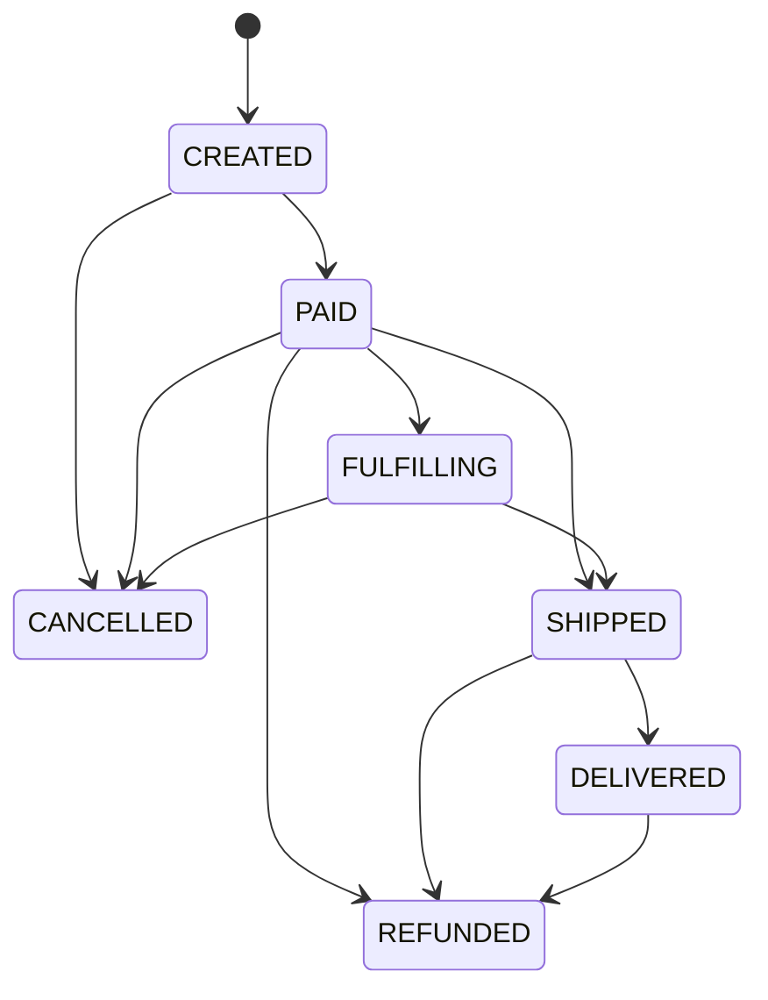

# Design Document: Corporate Cult E-Commerce

## Overview

Corporate Cult is a mobile-first, SEO-strong Gen-Z streetwear e-commerce platform for the India market. It sells corporate-humor T-shirts organized by a three-level "bravery" tier system (SAFE / DIRECT / VERY_DIRECT), fronted by a scroll-driven "university → corporate" narrative homepage, and fed by an AI-assisted design engine that generates slogans, moderates them automatically, renders mockups, and routes drafts to a mandatory human review queue before publication.

This design realizes the full requirements scope (Requirements 1–26) on the locked stack while keeping every non-MVP capability dormant behind feature flags. The architecture is intentionally partitioned into service modules with clear interfaces so that Phase 2/3 capabilities (AI Studio, POD, shipping aggregator, WhatsApp, referral, abandoned cart) can be switched on through configuration rather than rewrites.

### Design tenets (traceable to requirements)

- **Money is integer paise, always.** Every stored and computed monetary value is an integer number of paise in INR. Display divides by 100 with two decimals; no floating point participates in arithmetic (Req 26, Req 9, Req 7.6).
- **Owner inputs are configuration, never literals.** Brand identity, pricing thresholds, GST rate/GSTIN/HSN, legal text, POD provider, slogan bank, and every non-MVP toggle are sourced from `Config_Service` or seed data (Req 22, Req 9, Req 21).
- **AI never auto-publishes.** Every slogan crosses an automated `Moderation_Gate` and then a human approval action before a product becomes PUBLISHED (Req 13.8, Req 15.7).
- **Graceful degradation is a feature.** The site is fully shoppable with JavaScript disabled, animations off, and on low-end devices (Req 4).
- **Security and validation are pervasive.** Every request body/form/webhook is Zod-validated before processing; secrets live only in env; Prisma parameterizes all queries (Req 23).

### Locked technology stack

| Concern | Technology |
| --- | --- |
| Framework / rendering | Next.js (App Router), React, TypeScript; SSR + ISR |
| Styling | Tailwind CSS |
| Data | PostgreSQL + Prisma (Prisma Migrate) |
| Auth | Auth.js (email + phone OTP), httpOnly secure cookies |
| Payments | Razorpay (INR/GST), UPI-first |
| Storage / media | S3 or R2 (object storage) + Cloudinary (delivery/transforms) |
| AI | Anthropic Claude API (model id from config) |
| Animation | GSAP + Framer Motion (2D), Three.js (3D scene) |
| Validation | Zod schemas at every boundary |
| Monitoring | Sentry; Analytics GA4 + PostHog |

## Architecture

### System context



### Layering and separation of concerns

The system is organized in four layers so transport, business logic, and rendering evolve independently:

1. **Edge / middleware layer** — Next.js middleware enforces cross-cutting concerns before any handler runs: admin route authorization, feature-flag gating, CSRF verification, rate limiting per source identifier, and security headers (CSP/HSTS/X-Frame-Options/Referrer-Policy). This is the single choke point for Req 11.1, Req 22.3/22.4, Req 23.4/23.5/23.6/23.7.
2. **Route handler / server-component layer** — Parses and Zod-validates input, resolves the current session/role, and delegates to service modules. No business rules live here beyond validation and orchestration.
3. **Service layer** — Pure(ish) domain modules listed above. The `Money`, pricing, GST, cart-merge, coupon, moderation-scoring, mockup-fit, filter-parsing, and order-state-machine logic are written as pure functions to maximize testability (these are the property-tested cores).
4. **Persistence / integration layer** — Prisma repositories and external adapters (Razorpay, Claude, object storage, Cloudinary, notification providers, `Fulfillment_Provider`). All external effects are isolated behind interfaces so the pure logic can be tested with mocks.

### Rendering strategy

- Catalog, collection, and product pages render on the server (SSR) or via ISR so the initial HTML contains rendered content and SEO metadata (Req 19.1, Req 2.4).
- The homepage ships minimal critical JS (≤200 KB gzipped before hydration for the hero), code-splits GSAP/Three.js, and loads them after FCP (Req 4.5, Req 4.6). Static, readable fallbacks are server-rendered for no-JS, reduced-motion, low-end device, and library-load-timeout cases (Req 4.2, 4.3, 4.7, 4.10).

### Feature-flag gating flow



## Components and Interfaces

Each component is a server-side module with a typed interface. Signatures are TypeScript-flavored pseudocode; all monetary parameters are `Paise` (a branded integer type).

### Config_Service

Provides brand config, feature flags, tax settings, shipping rules, and thresholds. Validates required brand config at startup and fails fast if absent (Req 22.6).

```ts
type Flag = "aiStudio" | "reviews" | "homepage3D" | "pod"
          | "shippingAggregator" | "whatsapp" | "referral" | "abandonedCart";

interface Config_Service {
  brand(): { name: string; logoUrl: string; colorTokens: Record<string,string> }; // name 1..100 chars
  isEnabled(flag: Flag): boolean;            // all default false (Req 22.2)
  gstRatePercent(): number;                  // 0..28 (Req 9.1)
  sellerGstin(): string;                     // 15 chars (Req 9.6)
  garmentHsn(): string;
  freeShippingThreshold(): Paise;            // 0..99,999,999 (Req 17.2)
  flatShippingCharge(): Paise;
  codLimits(): { min: Paise; max: Paise };
  moderationThresholds(): { review: number; autoReject: number }; // 0..1, review < autoReject
  claudeModelId(): string;                   // Req 12.8
  timezone(): string;
  lowStockThreshold(): number;
  crossSellCount(): number;
  returnsWindow(): string; dispatchTime(): string;
  rateLimits(): Record<string, { max: number; windowSeconds: number }>;
  validateStartup(): void;                   // throws identifying missing config
}
```

### Money module (paise arithmetic)

The single source of truth for monetary correctness (Req 26). Pure, no I/O.

```ts
type Paise = number & { readonly __brand: "Paise" };
const MONEY_MAX = 9_999_999_999;

function makePaise(n: number): Result<Paise, MoneyError>; // integer & 0..MONEY_MAX else error
function add(a: Paise, b: Paise): Result<Paise, MoneyError>;
function sub(a: Paise, b: Paise): Result<Paise, MoneyError>; // clamps at 0 where specified by caller
function applyRatePercentHalfUp(base: Paise, ratePercent: number): Paise; // round half up to nearest paise
function toINRString(p: Paise): string;      // divide by 100, exactly 2 decimals, stored value unchanged
```

### Catalog_Service

Owns products, collections, variants, statuses, tiers, and fulfillment mode. Enforces slug/SKU uniqueness and value ranges (Req 1, Req 16.4/16.5).

```ts
interface Catalog_Service {
  createProduct(input: ProductInput): Result<Product, CatalogError>;   // unique slug, one tier, one collection
  createVariant(input: VariantInput): Result<Variant, CatalogError>;   // unique SKU
  getPublishedForDisplay(query: ShopQuery): Page<Product>;             // only PUBLISHED (Req 1.8)
  transitionStatus(productId: Id, next: ProductStatus): Result<Product, CatalogError>;
}
// slug: 1..200 unique; SKU: 1..64 unique; price/override: Paise 0..99,999,999; stock: int 0..1,000,000
// status ∈ {DRAFT, PENDING_REVIEW, PUBLISHED, ARCHIVED}; tier ∈ {SAFE, DIRECT, VERY_DIRECT}
// fulfillmentMode ∈ {SELF, POD} default SELF
```

### Shop_UI (faceted browsing logic)

Parses filter/sort params from URL, sanitizes invalid params, applies AND-combined filters, paginates 24/page, emits canonical + rel prev/next (Req 2).

```ts
interface ShopQueryParser {
  parse(searchParams: URLSearchParams): ShopQuery; // ignores unrecognized/malformed/out-of-range params
  encode(query: ShopQuery): string;                // round-trippable with parse for valid queries
}
type ShopQuery = {
  tier?: Tier[]; collection?: string[]; color?: string[]; size?: string[];
  priceMinInr?: number; priceMaxInr?: number;        // 0..999,999
  sort: "newest" | "priceAsc" | "priceDesc" | "bestSelling"; // default "newest"
  page: number;                                      // >= 1
};
```

### Cart_Service

Guest carts (session id) and user carts; merge-on-login with quantity summing capped at stock; checkout revalidation against live stock; 30-day guest retention (Req 5).

```ts
interface Cart_Service {
  addLine(cartRef: CartRef, variantId: Id, qty: int): Result<Cart, CartError>; // qty 1..99
  mergeGuestIntoUser(guest: Cart, user: Cart, stockOf: (v:Id)=>int): Cart;      // sum matching, cap at stock
  revalidateAtCheckout(cart: Cart, stockOf: (v:Id)=>int): { cart: Cart; notices: CartNotice[] };
  // qty>stock>0 -> reduce + notice; stock==0 -> remove line + notice
}
```

### Auth_Service

Auth.js-based email + phone OTP. 6-digit OTP, 5-minute expiry, 5-attempt lock, per-phone rate limits (≤3/10min, ≥30s spacing), httpOnly secure cookie, role default CUSTOMER (Req 6).

```ts
interface Auth_Service {
  requestOtp(phone: string, now: Instant): Result<OtpIssued, AuthError>; // valid 10-digit Indian mobile only
  verifyOtp(phone: string, code: string, now: Instant): Result<Session, AuthError>;
  // wrong code -> record attempt, keep remaining; 5 wrong -> invalidate; expired (>5min) -> reject
}
```

### Checkout_Service

Guest checkout without account, pincode → city/state autofill, itemized totals, coupon application with total floored at 0 paise, integer-paise throughout, price snapshots on order (Req 7).

```ts
interface Checkout_Service {
  autofillPincode(pincode: string): Result<{ city: string; state: string }, CheckoutError>; // 6-digit, serviceable
  priceOrder(cart: Cart, coupon?: CouponCode, ship?: Paise): OrderTotals; // subtotal, discount, shipping, tax, total
  applyCoupon(totals: OrderTotals, coupon: Coupon): Result<OrderTotals, CouponError>; // total >= 0 paise
}
type OrderTotals = { subtotal: Paise; discount: Paise; shipping: Paise; tax: Paise; total: Paise };
```

### Payment_Service

Razorpay order creation in integer paise, UPI-first ordering, server-side signature verification, idempotent webhook handling as authoritative status, COD gating, no credential storage (Req 8).

```ts
interface Payment_Service {
  createRazorpayOrder(order: Order): Result<RazorpayOrderRef, PaymentError>; // amount == order.total paise
  verifySignature(payload: RazorpayCallback): boolean;                       // server-side
  handleWebhook(evt: RazorpayWebhook): WebhookResult;                        // verify sig; idempotent
  codEligible(pincode: string, orderValue: Paise): boolean;                  // serviceable & within min..max
}
```

### Invoice_Service

Per-line GST at configured rate, half-up rounding to paise, CGST/SGST vs IGST by state, GSTIN + HSN + unique invoice number, INR display derived from paise, generate on paid-and-no-existing-invoice (Req 9).

```ts
interface Invoice_Service {
  computeLineTax(lineNet: Paise, ratePercent: number): Paise;          // half-up
  taxBreakup(order: Order, sellerState: string): CgstSgst | Igst;      // intra vs inter-state
  generateInvoice(order: Order): Result<Invoice, InvoiceError>;        // only if paid && none exists
}
```

### Order_Service

Order lifecycle state machine, tracking capture on ship, snapshots, admin filters/CSV export, refund flow, fulfillment routing (Req 10, Req 16).

```ts
type OrderStatus = "CREATED"|"PAID"|"FULFILLING"|"SHIPPED"|"DELIVERED"|"CANCELLED"|"REFUNDED";
interface Order_Service {
  transition(order: Order, next: OrderStatus, ctx: TransitionCtx): Result<Order, OrderError>;
  // SHIPPED requires non-empty tracking id+url and current status PAID|FULFILLING
  routeFulfillment(order: Order, flags: Flags): FulfillmentPlan; // SELF unless POD flag+mode POD
  exportCsv(filter: OrderFilter): string; // one row/order
}
```

Allowed transitions:



### AI_Engine

Validates generation params, calls Claude with brand/tier/policy/few-shot system prompt, requires structured JSON validated against schema (one repair retry), 60s timeout, dedupes by normalized text + embedding cosine ≥ 0.9, records token/cost to audit, model id from config, ≤10 runs/admin/60min (Req 12).

```ts
interface AI_Engine {
  validateParams(p: GenParams): Result<GenParams, AIError>; // count 1..20, known tier, existing collection
  generate(p: GenParams): Promise<Result<Slogan[], AIError>>;
  isDuplicate(candidate: string, existing: string[], embed: Embedder): boolean; // normalized OR cosine>=0.9
}
```

### Moderation_Gate

Evaluates every candidate before Review_Queue entry: auto-reject categories, real-entity defamation reject, threshold-band routing, VERY_DIRECT always to human review, records decisions, no publish without human approval, 30s evaluation timeout withholds (Req 13).

```ts
type ModOutcome = "AUTO_REJECT" | "NEEDS_REVIEW" | "ADMIT";
interface Moderation_Gate {
  evaluate(slogan: Slogan, thresholds: {review:number; autoReject:number}): ModDecision;
  // score >= autoReject OR prohibited category -> AUTO_REJECT
  // review <= score < autoReject OR tier==VERY_DIRECT -> NEEDS_REVIEW
  // else -> ADMIT ; never yields "publish"
}
```

### Mockup_Renderer

Selects Blank_Template by garment+color, composites text strictly within print area, auto-fits font 12–144 pt with line breaks, ≥1000px preview + hi-res placeholder, stores to object storage and records URL, ≥2 layout presets/tier incl. monospace for Operator, error cases for no template / too-long / storage failure (Req 14).

```ts
interface Mockup_Renderer {
  selectTemplate(garment: string, color: string): Result<BlankTemplate, MockupError>;
  fitText(text: string, printArea: Rect): Result<TextLayout, MockupError>; // font 12..144, wraps, within bounds
  render(design: Design): Promise<Result<MockupResult, MockupError>>;      // stores + records URL
}
```

### Review_Queue

Displays pending drafts with slogan/tier/preview/risk flags; per-item approve+publish, edit, regenerate, reject; bulk-approve ≤100 SAFE PENDING_REVIEW; blocks publish without approval; regenerate keeps PENDING_REVIEW; guards status precondition (Req 15).

### Fulfillment_Provider adapter

Interface abstracting SELF (active) and POD (stubbed, no network, "not configured"). POD order creation on paid POD product when flag enabled and no existing POD order id (Req 16).

```ts
interface Fulfillment_Provider {
  createProduct(p: Product): Promise<FulfillResult>;
  createOrder(o: Order): Promise<FulfillResult>;
  getRates(dest: Address): Promise<FulfillResult>;
  getTracking(ref: string): Promise<FulfillResult>;
  handleWebhook(evt: unknown): Promise<FulfillResult>;
}
```

### Shipping_Service

Threshold-based flat/free shipping, Owner_Input thresholds, pincode serviceability ≤3s, aggregator behind flag with 10s-timeout fallback to flat rate + local pincode list (Req 17).

### Notification_Service

Email always; WhatsApp behind flag; confirmation on paid and tracking on shipped within 60s; retry up to Owner_Input max; terminal failure recorded without altering order status (Req 18).

### Analytics + SEO layer

SSR/ISR HTML content, title/description/canonical bounds, sitemap of PUBLISHED-only regenerated within 300s of publish-state change, GA4 + PostHog events within 2s non-blocking, Open Graph + JSON-LD (Req 19).

## Data Models

Prisma-backed PostgreSQL schema (abridged; all money fields are `Int` paise).

```prisma
enum Tier { SAFE DIRECT VERY_DIRECT }
enum ProductStatus { DRAFT PENDING_REVIEW PUBLISHED ARCHIVED }
enum FulfillmentMode { SELF POD }
enum OrderStatus { CREATED PAID FULFILLING SHIPPED DELIVERED CANCELLED REFUNDED }
enum Role { CUSTOMER ADMIN }

model Product {
  id            String  @id @default(cuid())
  slug          String  @unique          // 1..200
  slogan        String
  tier          Tier
  collectionId  String
  collection    Collection @relation(fields:[collectionId], references:[id])
  status        ProductStatus @default(DRAFT)
  basePrice     Int                        // paise 0..99,999,999
  aiGenerated   Boolean @default(false)
  fulfillmentMode FulfillmentMode @default(SELF)
  seoTitle      String?  // 1..60
  seoDescription String? // 1..160
  mockupUrl     String?
  variants      Variant[]
  reviews       Review[]
  createdAt     DateTime @default(now())
}

model Variant {
  id        String @id @default(cuid())
  productId String
  product   Product @relation(fields:[productId], references:[id])
  sku       String  @unique               // 1..64
  color     String
  size      String
  fit       String
  priceOverride Int?                       // paise 0..99,999,999
  stock     Int     @default(0)            // 0..1,000,000
  podVariantId String?                     // default unset (Req 16.5)
  @@unique([productId, color, size, fit])
}

model Collection { id String @id @default(cuid()) slug String @unique title String heroImage String? sortOrder Int @default(0) products Product[] }

model User { id String @id @default(cuid()) email String? @unique phone String? @unique role Role @default(CUSTOMER) createdAt DateTime @default(now()) addresses Address[] orders Order[] wishlist WishlistItem[] }

model WishlistItem { id String @id @default(cuid()) userId String productId String @@unique([userId, productId]) } // one per product per user (Req 5.6)

model Cart { id String @id @default(cuid()) sessionId String? userId String? updatedAt DateTime @updatedAt lines CartLine[] } // guest retained >=30d from updatedAt
model CartLine { id String @id @default(cuid()) cartId String variantId String qty Int } // qty 1..99

model Otp { id String @id @default(cuid()) phone String codeHash String issuedAt DateTime expiresAt DateTime attempts Int @default(0) consumed Boolean @default(false) } // 6-digit, 5min, 5 attempts

model Order {
  id String @id @default(cuid())
  userId String?
  status OrderStatus @default(CREATED)
  currency String @default("INR")
  subtotal Int  discount Int  shipping Int  tax Int  total Int   // paise
  addressSnapshot Json
  lineSnapshots  Json          // per-item price snapshots (Req 10.4, 7.7)
  fulfillmentMode FulfillmentMode @default(SELF)
  podOrderId String?           // default unset (Req 16.5)
  razorpayOrderId String?  razorpayPaymentId String?  razorpaySignature String?  paymentMethod String?
  trackingId String?  trackingUrl String?
  createdAt DateTime @default(now())
  invoice Invoice?
}

model Invoice { id String @id @default(cuid()) orderId String @unique invoiceNumber String @unique sellerGstin String hsn String taxBreakup Json createdAt DateTime @default(now()) }

model Coupon { id String @id @default(cuid()) code String @unique discountType String discountValue Int minSubtotal Int active Boolean expiresAt DateTime? singleUse Boolean @default(false) }

model Design { id String @id @default(cuid()) slogan String tier Tier moderationOutcome String riskFlags Json mockupUrl String? productId String? createdAt DateTime @default(now()) }

model BlankTemplate { id String @id @default(cuid()) garment String color String printArea Json preset String @@unique([garment, color, preset]) } // seed idempotent

model SloganBankEntry { id String @id @default(cuid()) text String @unique tier Tier } // seed data, idempotent

model AuditLog { id String @id @default(cuid()) actorId String actionType String entityType String entityId String detail Json createdAt DateTime @default(now()) } // immutable

model ConsentEvent { id String @id @default(cuid()) userId String? purpose String granted Boolean createdAt DateTime @default(now()) } // DPDP (Req 21.3/21.4)

model NewsletterSub { id String @id @default(cuid()) email String @unique source String createdAt DateTime @default(now()) } // no duplicates (Req 20.6)
```

Key model notes:

- All monetary columns are `Int` paise, range-guarded in the service layer via the `Money` module (Req 26).
- Uniqueness constraints back slug, SKU, invoice number, newsletter email, `(userId, productId)` wishlist, `(productId,color,size,fit)` variant, and seed keys — supporting the reject-on-duplicate behaviors.
- `AuditLog` rows are append-only; the service layer exposes no update/delete for them (Req 11.2, immutability).

## Correctness Properties

*A property is a characteristic or behavior that should hold true across all valid executions of a system — essentially, a formal statement about what the system should do. Properties serve as the bridge between human-readable specifications and machine-verifiable correctness guarantees.*

These properties target the pure logic cores identified in the Architecture (money, pricing/GST, cart merge, coupon, moderation routing, mockup fit, filter parsing, state machines, validation, rate limiting). External effects are mocked so each property runs cheaply for 100+ iterations. Properties have been consolidated per the prework reflection to remove redundancy.

### Property 1: Integer-paise closure and half-up rounding

*For any* sequence of monetary values and arithmetic operations, every stored/computed result is an integer number of paise within 0..9,999,999,999; any non-integer intermediate is rounded to the nearest paise with halves rounding up; and any attempt to store a non-integer or out-of-range value is rejected while the prior value is retained.

**Validates: Requirements 26.1, 26.2, 26.3, 26.6, 7.6, 1.9**

### Property 2: INR display derivation

*For any* stored paise value, the displayed string equals the value divided by 100 formatted with exactly two decimal places, and the stored value is unchanged by display.

**Validates: Requirements 26.5, 9.7**

### Property 3: Unique-key insertion rejects duplicates and preserves state

*For any* existing store of products (by slug) or variants (by SKU), inserting an item whose key duplicates an existing key is rejected with a key-in-use error and leaves the existing item and store unchanged; accepted keys always satisfy their length bounds (slug 1..200, SKU 1..64).

**Validates: Requirements 1.4, 1.5, 1.11, 1.12**

### Property 4: Customer-facing catalog returns only PUBLISHED

*For any* catalog containing products of mixed statuses, every product returned by a customer-facing display query has status PUBLISHED.

**Validates: Requirements 1.8**

### Property 5: Shop query encode/parse round trip

*For any* valid ShopQuery, encoding it to URL parameters and parsing the result yields an equivalent ShopQuery.

**Validates: Requirements 2.3**

### Property 6: Invalid shop parameters are ignored

*For any* valid ShopQuery with arbitrary unrecognized, malformed, or out-of-range parameters injected, parsing the polluted parameters yields the same ShopQuery as parsing the clean parameters (invalid parameters discarded, valid ones retained).

**Validates: Requirements 2.6**

### Property 7: Filters combine with AND

*For any* product set and set of active filters, every product in the results satisfies every active filter, and no product satisfying all active filters within the first page window is omitted.

**Validates: Requirements 2.5**

### Property 8: Pagination page-size invariant

*For any* catalog and page number, the returned page contains at most 24 products, and rel-prev/rel-next links are present exactly when a previous/next page exists.

**Validates: Requirements 2.8**

### Property 9: Variant availability tracks stock

*For any* variant, the PDP enables add-to-cart and buy-now for a complete selection of that variant if and only if its stock quantity is greater than zero.

**Validates: Requirements 3.4**

### Property 10: Incomplete variant selection is rejected

*For any* incomplete variant selection, add-to-cart and buy-now are rejected and the shopper is prompted to complete the selection.

**Validates: Requirements 3.11**

### Property 11: Structured-data and tier-badge emission

*For any* product, the rendered PDP emits Product and Offer JSON-LD containing the required fields; a VERY_DIRECT product additionally shows the spicy indicator; and a product with at least one approved review additionally emits AggregateRating JSON-LD.

**Validates: Requirements 3.2, 3.8, 3.13**

### Property 12: Homepage degradation decision

*For any* environment descriptor, the homepage renders static non-animated fallbacks when prefers-reduced-motion is reduce, JavaScript is disabled, or the animation libraries fail to load within the timeout; and it disables the Three.js scene (static image instead) when device memory is below 4 GB, logical cores are fewer than 4, effective connection is slower than 4g, or prefers-reduced-motion is reduce.

**Validates: Requirements 4.2, 4.3, 4.7, 4.10**

### Property 13: Featured products are shoppable

*For any* set of products featured in the narrative, each featured product has a resolvable standard shop/PDP link and a functional add-to-cart action independent of JavaScript.

**Validates: Requirements 4.8, 4.9**

### Property 14: Cart line quantity bounds

*For any* add-to-cart request, the line quantity is accepted only when it is an integer from 1 to 99 inclusive, and rejected otherwise.

**Validates: Requirements 5.1, 5.2**

### Property 15: Guest-to-user cart merge sums and caps at stock

*For any* guest cart, user cart, and stock map, after merge each variant present in either cart has quantity equal to the minimum of the summed matching quantities and its available stock, and no non-matching line is lost.

**Validates: Requirements 5.3**

### Property 16: Checkout stock revalidation

*For any* cart and stock map, at checkout each line whose variant has stock zero is removed with a notice, and each line whose quantity exceeds available stock greater than zero is reduced to the available stock with a notice; all other lines are unchanged.

**Validates: Requirements 5.4, 5.8**

### Property 17: Wishlist entry idempotence

*For any* authenticated user and product, adding that product to the wishlist any number of times results in at most one wishlist entry for that product.

**Validates: Requirements 5.6**

### Property 18: Indian mobile validation for OTP

*For any* string, an OTP request is accepted only when the string is a valid 10-digit Indian mobile number and rejected with an invalid-phone error otherwise.

**Validates: Requirements 6.2**

### Property 19: OTP issuance format and expiry

*For any* issued OTP, the code is a 6-digit numeric value and its expiry instant equals its issuance instant plus 5 minutes.

**Validates: Requirements 6.3**

### Property 20: OTP verification lifecycle

*For any* issued OTP and sequence of verification attempts, submitting the correct code within 5 minutes establishes a session; each incorrect submission is recorded and preserves remaining attempts; the OTP becomes invalid after 5 incorrect submissions; and any submission after 5 minutes is rejected as expired.

**Validates: Requirements 6.4, 6.5, 6.6, 6.7**

### Property 21: Rate limiting per identifier

*For any* time-ordered sequence of requests for a single identifier against a rate-limited endpoint, the number of accepted requests within any rolling window never exceeds the configured maximum, excess requests are rejected without processing, and any configured minimum inter-request interval is enforced.

**Validates: Requirements 6.12, 6.13, 11.10, 11.11, 12.10, 23.7, 23.10**

### Property 22: Pincode autofill correctness

*For any* pincode input, city and state are populated exactly when the input is a valid 6-digit serviceable pincode; otherwise the input is rejected, the city and state fields remain empty, and an invalid/unrecognized error is shown.

**Validates: Requirements 7.2, 7.10**

### Property 23: Coupon application floors total at zero and never increases it

*For any* order totals and valid coupon, the resulting order total is greater than or equal to 0 paise and less than or equal to the pre-discount total.

**Validates: Requirements 7.4**

### Property 24: Invalid coupon leaves total unchanged

*For any* coupon that is expired, inactive, or below its minimum subtotal, applying it leaves the order total unchanged and returns an error stating the reason.

**Validates: Requirements 7.5**

### Property 25: Order price snapshots match source prices

*For any* checkout, the created order records per-line price snapshots equal to the current server-side variant prices at checkout time.

**Validates: Requirements 7.7**

### Property 26: Contact validation on guest checkout

*For any* guest checkout submission, the submission is accepted only when the email is a valid email format and the phone is a valid 10-digit Indian mobile number; otherwise it is rejected, previously entered details are retained, and the invalid field is identified.

**Validates: Requirements 7.1, 7.9**

### Property 27: Razorpay order amount equals order total

*For any* order, the Razorpay order created before checkout has an amount in integer paise equal to the order total.

**Validates: Requirements 8.1**

### Property 28: Payment signature verification

*For any* payment callback, server-side verification succeeds if and only if the signature is a valid HMAC of the payload under the secret key; a failed verification leaves the order in an unpaid state.

**Validates: Requirements 8.3, 8.4**

### Property 29: Webhook idempotence

*For any* verified Razorpay webhook applied to an order, applying the same webhook one or more additional times produces no state change beyond the first application.

**Validates: Requirements 8.5, 8.6**

### Property 30: COD eligibility predicate

*For any* delivery pincode and order value, COD is offered if and only if the pincode is serviceable and the order value is within the configured COD minimum and maximum inclusive.

**Validates: Requirements 8.8**

### Property 31: No payment credentials stored

*For any* paid order record, the stored data contains no card or UPI credential values.

**Validates: Requirements 8.9**

### Property 32: GST rate configuration bounds

*For any* submitted GST rate, the change is accepted only when the rate is between 0 and 28 percent inclusive; otherwise it is rejected and the previous rate is retained.

**Validates: Requirements 9.1, 9.2**

### Property 33: Per-line GST computation is half-up integer paise

*For any* line net amount and configured rate, the computed GST equals the reference half-up rounding of net × rate ÷ 100 and is an integer number of paise.

**Validates: Requirements 9.3**

### Property 34: Tax breakup by delivery state

*For any* order and seller state, the tax breakup is CGST plus SGST when the delivery address is within the seller's state and IGST when it is in a different state, and the CGST plus SGST total equals the equivalent IGST total for the same taxable base.

**Validates: Requirements 9.4**

### Property 35: Invoice generation on paid is idempotent

*For any* order, an invoice is generated exactly when the order is marked paid and no invoice already exists, and marking an already-invoiced order paid again creates no additional invoice; each generated invoice has a unique invoice number.

**Validates: Requirements 9.8**

### Property 36: Order status transitions honor the allowed set

*For any* order and requested status transition, the transition succeeds only if it is in the allowed-transition set; any disallowed transition is rejected and leaves the order status unchanged.

**Validates: Requirements 10.11**

### Property 37: Shipping requires tracking and valid source status

*For any* order and ship request, the transition to SHIPPED succeeds if and only if a non-empty tracking identifier and tracking URL are provided and the current status is PAID or FULFILLING; otherwise the action is rejected and the status is unchanged.

**Validates: Requirements 10.2, 10.9**

### Property 38: Refund transition depends on gateway outcome

*For any* PAID order, a successful Razorpay refund transitions the order to REFUNDED, and a failed refund leaves the order status unchanged with an error.

**Validates: Requirements 10.7, 10.10**

### Property 39: Order CSV export row fidelity

*For any* filtered set of orders, the exported CSV contains exactly one row per order, and each row contains the order identifier, status, total, creation date, and customer contact.

**Validates: Requirements 10.6**

### Property 40: Order filtering correctness

*For any* order set and status plus inclusive creation-date-range filter, every returned order satisfies the selected status and falls within the date range.

**Validates: Requirements 10.5**

### Property 41: Admin authorization gate

*For any* request to an Admin_Panel route, the request proceeds only when the actor's role is ADMIN; a non-admin request is rejected, performs no create/read/update/delete operation, returns an authorization error, and discloses no protected content.

**Validates: Requirements 11.1**

### Property 42: Immutable audit logging of mutations

*For any* admin create, update, or delete action, exactly one audit log entry is written recording the actor identifier, action type, entity type, entity identifier, and timestamp, and no operation mutates an existing audit entry.

**Validates: Requirements 11.2, 13.7**

### Property 43: Dashboard aggregation correctness

*For any* set of orders and variants for the current store-timezone day, the dashboard revenue equals the sum of that day's paid order totals, the order count equals the number of that day's orders, low-stock alerts list exactly the variants at or below the threshold, and the pending-review count equals the number of PENDING_REVIEW products.

**Validates: Requirements 11.3**

### Property 44: Generation parameter validation

*For any* generation request, it is accepted only when the count is between 1 and 20 inclusive, the tier is a known value, and the collection exists; otherwise it is rejected with an invalid-parameter error.

**Validates: Requirements 12.1, 12.2**

### Property 45: Claude response schema validation with single repair retry

*For any* sequence of Claude responses, a schema-valid response is accepted; a schema-invalid response triggers exactly one repair retry; and if the retried response also fails validation, the run is rejected and no slogans are persisted.

**Validates: Requirements 12.4, 12.5**

### Property 46: Generation failure persists nothing

*For any* Claude timeout (beyond 60 seconds) or error response, the generation run fails and persists no slogans.

**Validates: Requirements 12.6**

### Property 47: Slogan de-duplication

*For any* candidate slogan that, after case-insensitive whitespace normalization, matches an existing slogan or has embedding cosine similarity of at least 0.9 to an existing slogan, the candidate is detected as a duplicate.

**Validates: Requirements 12.7**

### Property 48: Configured model and cost auditing

*For any* generation run, the Claude request uses the model identifier read from configuration, and upon completion a run's token usage and cost are recorded to the audit log.

**Validates: Requirements 12.8, 12.9**

### Property 49: Moderation routing is exhaustive and never publishes

*For any* candidate slogan and thresholds where the review threshold is less than the auto-reject threshold, the moderation outcome is exactly one of AUTO_REJECT, NEEDS_REVIEW, or ADMIT and never a publish; a slogan in a prohibited category (hate/slurs/protected-class, real-entity naming/defamation, sexual/harassment/threats/self-harm/illegal) or with score at or above the auto-reject threshold yields AUTO_REJECT; a score in the band review ≤ score < auto-reject, or a VERY_DIRECT tier, yields NEEDS_REVIEW; otherwise ADMIT.

**Validates: Requirements 13.1, 13.2, 13.3, 13.4, 13.5, 13.6, 13.8**

### Property 50: Moderation outcome consequences

*For any* evaluated slogan, an AUTO_REJECT outcome excludes it from the Review_Queue and records the rejection reason, an ADMIT outcome admits it to the Review_Queue, and an evaluation timeout or failure withholds it from the Review_Queue; in no case is it published.

**Validates: Requirements 13.9, 13.10, 13.11**

### Property 51: Mockup text fits within print area

*For any* slogan and print area where the text can fit, the rendered text layout's bounding box lies entirely within the print-area boundaries and the selected font size is between 12 and 144 points.

**Validates: Requirements 14.2, 14.3**

### Property 52: Unfittable slogan errors without preview

*For any* slogan that cannot fit within the print area at the minimum 12-point font size, the renderer produces no preview image and returns a too-long error.

**Validates: Requirements 14.8**

### Property 53: Template selection matches request or errors

*For any* set of blank templates and a requested garment and color, the renderer selects a template whose garment and color match the request, or returns a no-matching-template error and renders no mockup when none matches.

**Validates: Requirements 14.1, 14.7**

### Property 54: Preview storage records URL only on success

*For any* successful render, the preview image is at least 1000 pixels on its longest edge, a high-resolution placeholder reference is recorded, and the resulting storage URL is recorded on the associated Design and Product; if storage fails, no storage URL is recorded on the Design or Product and an error is returned.

**Validates: Requirements 14.4, 14.5, 14.9**

### Property 55: AI draft creation shape

*For any* gate-approved slogan with a rendered mockup, the created Product has status PENDING_REVIEW, the aiGenerated flag set true, and default variants covering the configured default color, size, and fit combinations.

**Validates: Requirements 15.1**

### Property 56: Draft approval and rejection transitions

*For any* draft, approval transitions the product to PUBLISHED and rejection transitions it to ARCHIVED only when the product is in status PENDING_REVIEW; if the product is not in status PENDING_REVIEW, the action is rejected and the status is unchanged; and no PENDING_REVIEW product becomes PUBLISHED without an approval action.

**Validates: Requirements 15.4, 15.5, 15.7, 15.10**

### Property 57: Bulk approve eligibility and cap

*For any* batch of drafts, the bulk-approve action publishes only drafts that are both tier SAFE and status PENDING_REVIEW, and processes at most 100 drafts per action.

**Validates: Requirements 15.6**

### Property 58: Mockup regeneration preserves review status

*For any* draft, regenerating the mockup keeps the product in status PENDING_REVIEW; a successful regeneration updates the preview, and a failed regeneration retains the existing preview and returns an error.

**Validates: Requirements 15.8, 15.9**

### Property 59: POD stub returns not-configured without network

*For any* operation invoked on the stubbed POD Fulfillment_Provider, the result is a "not configured" response and no external network call is made.

**Validates: Requirements 16.1, 16.2, 16.3**

### Property 60: Fulfillment routing decision

*For any* combination of POD feature flag, product fulfillment mode, order status, and existing POD order identifier, fulfillment routes to the self-fulfillment implementation when the POD flag is disabled or the product mode is SELF; and when the POD flag is enabled, the product mode is POD, the order is paid, and no POD order identifier exists, a POD order is created through the POD implementation and the returned identifier is recorded on the order.

**Validates: Requirements 16.6, 16.7, 16.8**

### Property 61: POD order creation failure handling

*For any* POD order creation that fails, the POD order identifier remains unset, the order remains in the paid state, and an error is recorded.

**Validates: Requirements 16.9**

### Property 62: Shipping charge threshold

*For any* order subtotal, free-shipping threshold, and flat charge, the shipping charge equals the flat charge when the subtotal is below the threshold and zero when the subtotal is at or above the threshold.

**Validates: Requirements 17.1**

### Property 63: Non-serviceable pincode blocks payment

*For any* delivery pincode that is not serviceable, checkout prevents progression to payment and displays a not-serviceable message.

**Validates: Requirements 17.6**

### Property 64: Shipping aggregator fallback

*For any* aggregator timeout (beyond 10 seconds) or error, the Shipping_Service falls back to the configured flat shipping charge and the locally configured serviceable-pincode list.

**Validates: Requirements 17.7**

### Property 65: Notification retry bound and order invariance

*For any* sequence of failing notification delivery attempts, the number of retries does not exceed the configured maximum, and a terminal failure is recorded without altering the order status.

**Validates: Requirements 18.4, 18.5**

### Property 66: SEO metadata bounds

*For any* catalog, collection, or product page, the emitted title is 1 to 60 characters, the meta description is 1 to 160 characters, and the canonical URL is an absolute URL for the page.

**Validates: Requirements 19.2**

### Property 67: Sitemap includes only published items

*For any* catalog, the generated XML sitemap contains entries for exactly the PUBLISHED products and active collections, excluding all non-published items.

**Validates: Requirements 19.3**

### Property 68: Analytics failure is non-blocking

*For any* analytics provider failure, the page is still served and the shopper action completes without blocking on analytics delivery.

**Validates: Requirements 19.8**

### Property 69: Newsletter subscription idempotence

*For any* valid email, subscribing any number of times records at most one subscription and always returns a subscription confirmation; an invalid email format is rejected with an invalid-email error.

**Validates: Requirements 20.1, 20.5, 20.6**

### Property 70: Referral code single use

*For any* issued referral discount code, it can be redeemed at most once; a second redemption attempt is rejected.

**Validates: Requirements 20.2**

### Property 71: Team-pack discount condition and floor

*For any* ordered quantity and order totals, the team-pack discount is applied if and only if the quantity is at or above the configured minimum, and the resulting order total is never less than 0 paise.

**Validates: Requirements 20.3**

### Property 72: Abandoned-cart reminder bound and cancellation

*For any* cart timeline, the number of abandoned-cart reminders sent does not exceed the configured maximum, and no further reminders are sent after the cart becomes paid or empty.

**Validates: Requirements 20.4, 20.7**

### Property 73: Policy page legal-review notice and placeholders

*For any* policy page, the pending-legal-review notice is displayed while the page's legal-approval marker is unset, and any missing Owner_Input legal text is rendered as an identifiable placeholder with no fabricated binding legal language.

**Validates: Requirements 21.2, 21.6**

### Property 74: Consent precedes personal-data collection

*For any* personal-data collection event, a prior affirmative, non-pre-selected consent event stating the purpose is recorded with a timestamp before the data is collected.

**Validates: Requirements 21.3**

### Property 75: Disabled feature flags gate capabilities

*For any* capability whose feature flag is disabled, the capability's entry points are omitted from the customer and admin interfaces, and any direct request to the capability is rejected with no action performed and no capability content disclosed.

**Validates: Requirements 22.2, 22.3, 22.4**

### Property 76: Startup config validation

*For any* brand configuration missing a required field, startup fails with an error that identifies the missing configuration.

**Validates: Requirements 22.6**

### Property 77: Schema validation before persistence

*For any* API request body, form submission, or webhook payload that fails its Zod schema, the request is rejected before any processing or persistence, no stored data is changed, and the error identifies the invalid field(s).

**Validates: Requirements 23.1, 23.2**

### Property 78: CSRF protection on state-changing requests

*For any* state-changing request, the request is rejected with no state change when a valid CSRF token is absent, and accepted when the token is valid.

**Validates: Requirements 23.6, 23.9**

### Property 79: Image format and dimensions

*For any* rendered content image, the served format is AVIF or WebP with explicit width and height attributes, and when the requesting browser does not accept the primary format a fallback image in an accepted format is served.

**Validates: Requirements 24.4, 24.5**

### Property 80: Error reporting retry is bounded and non-blocking

*For any* Sentry delivery that fails, delivery is retried at most 3 times and the in-progress user-facing request is neither interrupted nor blocked.

**Validates: Requirements 24.7**

### Property 81: Seed script idempotence

*For any* number of runs of the seed script against the same database, no duplicate slogan-bank or blank-template records are created.

**Validates: Requirements 25.8**

## Error Handling

The platform follows a consistent, layered error strategy. Business logic returns typed `Result<T, E>` values (no throwing for expected failures); only truly exceptional conditions throw and are caught at the route/middleware boundary.

### Error categories and responses

| Category | Examples | Handling |
| --- | --- | --- |
| Validation errors | Bad email/phone/pincode, out-of-range money, invalid coupon, invalid gen params, Zod failures | Reject before persistence; return 400 with field-level messages; no state change (Req 23.1/23.2, 7.9, 9.2, 12.2) |
| Authorization errors | Non-admin on admin route, disabled feature flag, missing/invalid CSRF | Reject with 403/404; no CRUD; disclose no content (Req 11.1, 22.4, 23.9) |
| Rate-limit errors | OTP/auth/AI/admin over limit | Reject excess with 429 "too many requests"; no processing (Req 6.13, 11.11, 12.10, 23.10) |
| Conflict errors | Duplicate slug/SKU/invoice number/newsletter email | Reject, retain existing, return key-in-use error (Req 1.11/1.12) |
| State-transition errors | Illegal order transition, ship without tracking, approve non-PENDING draft | Reject, leave status unchanged, return error (Req 10.9/10.11, 15.10) |
| External-service errors | Razorpay create/verify/refund fail, Claude timeout/error, storage fail, POD fail, aggregator timeout, notification fail, analytics/Sentry fail | Fail safe: leave domain state consistent (order unpaid / no slogans persisted / no URL recorded / fall back / retry-bounded); never block the user path for non-critical effects (Req 8.4/8.10, 12.5/12.6, 14.9, 16.9, 17.7, 18.4/18.5, 19.8, 24.7) |
| Moderation withholding | Evaluation timeout/failure | Withhold from queue, prevent publish, record failure (Req 13.11) |

### Fail-safe principles

- **Money never corrupts.** Any operation that would produce a non-integer or out-of-range paise value is rejected and the prior value retained (Property 1).
- **Payments are authoritative via verified webhooks.** Client callbacks are advisory; only signature-verified webhooks change paid state, and handling is idempotent (Properties 28, 29).
- **AI failures persist nothing.** Schema-invalid (after one repair) or timed-out generation runs leave no slogans and no drafts (Properties 45, 46).
- **Degradation over failure.** Homepage, shipping, notifications, analytics, and error reporting all have defined fallbacks so the core shopping path stays functional (Properties 12, 64, 65, 68, 80).

### Observability

Runtime errors are reported to Sentry with error type, stack trace, and request context within 10 seconds; Sentry delivery failures are retried up to 3 times without blocking the request (Req 24.6/24.7, Property 80). Moderation decisions, AI token/cost, and all admin mutations are written to the immutable audit log (Req 13.7, 12.9, 11.2, Properties 42, 48).

## Testing Strategy

The platform is strongly suited to property-based testing because its correctness hinges on pure logic cores — integer-paise money arithmetic, GST computation, cart merge, coupon flooring, moderation routing, mockup text-fit geometry, filter parsing, and state machines — where behavior varies meaningfully across a large input space. PBT is applied to those cores; example, integration, and smoke tests cover the rest.

### Dual approach

- **Property-based tests** verify the 81 universal properties above across randomized inputs. External effects (Razorpay, Claude, object storage, notification providers, analytics, Sentry, POD) are mocked so the pure logic is exercised cheaply and deterministically.
- **Unit (example) tests** cover concrete scenarios and defaults: sort default = newest (Req 2.2), empty-state message (Req 2.7), UPI-first ordering (Req 8.2), narrative act order (Req 4.1), role default CUSTOMER (Req 6.9), invoice content fields (Req 9.5/9.6), CRUD provisions (Req 11.4–11.9), cookie flags (Req 6.8), and share-asset availability messaging (Req 3.9/3.12).
- **Integration tests** cover external wiring with 1–3 representative examples: Razorpay payment + webhook flow (Req 8), Claude request/response, notification send-on-transition and 60s timing (Req 18.1/18.2), analytics dual-dispatch within 2s (Req 19.5), sitemap regeneration within 300s (Req 19.7), and pincode serviceability latency (Req 17.3).
- **End-to-end tests** cover the browse-to-paid flow (Req 25.6) and the AI generate → moderate → render → review → publish flow.
- **Smoke / configuration tests** cover one-time setup: security headers present with required directives (CSP allowlist, HSTS ≥ 31,536,000s, X-Frame-Options, Referrer-Policy — Req 23.4/23.5), secrets absent from source control (CI secret scan — Req 23.3), distinct env databases/secrets (Req 25.1), and Prisma migration drift check (Req 25.4).
- **Performance tests** (not PBT): Core Web Vitals budgets and mobile Lighthouse ≥ 90 for performance/SEO/accessibility, measured at the 75th percentile on simulated 4G (Req 24.1–24.3, 24.8, 4.4).

### Property-based testing requirements

- Use an established PBT library for the target language (TypeScript): **fast-check**. Do not implement property testing from scratch.
- Configure each property test to run a **minimum of 100 iterations**.
- Implement each correctness property with a **single** property-based test.
- Tag each property test with a comment referencing its design property, in the format:
  `// Feature: corporate-cult-ecommerce, Property {number}: {property_text}`
- Rely on generators to cover edge cases folded into properties: stock bounds (Req 1.10), monetary ranges (Req 26), whitespace/case/non-ASCII slogans (moderation/dedup), zero-stock and over-stock cart lines, boundary moderation scores, minimum-font mockup fits, and OTP expiry boundaries.

### Custom generators (fast-check arbitraries)

- `paiseArb` — integers spanning 0..9,999,999,999 plus out-of-range and non-integer values for rejection paths.
- `productArb` / `variantArb` — valid and boundary slugs/SKUs, mixed statuses, all tiers, stock across bounds.
- `shopQueryArb` — valid queries plus injected malformed/out-of-range parameters.
- `cartArb` + `stockMapArb` — carts with matching/non-matching variants and quantities straddling stock.
- `phoneArb` / `emailArb` / `pincodeArb` — valid and invalid India-format inputs.
- `sloganArb` — clean slogans plus category-tagged prohibited content, whitespace/case variants, and length extremes for print-fit.
- `orderArb` + `transitionArb` — orders in every status with legal and illegal transition requests.
- `requestSequenceArb` — timestamped request streams for rate-limit windows.
- `envDescriptorArb` — device memory, cores, connection type, prefers-reduced-motion, JS-enabled, library-load-timeout combinations.

### CI pipeline (Req 25.4/25.5/25.7)

On every pull request the CI runs lint, type check, unit tests (incl. property tests), e2e tests, and a Prisma migration drift check, using Razorpay test keys only; any failing check blocks merge and reports the failure.
